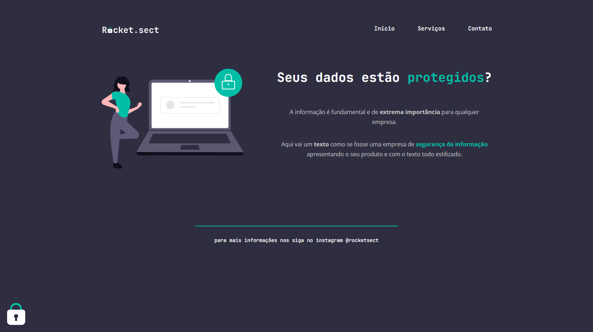

# Explorer Stage 02 - projeto final

> Explorer

Projeto foi desenvolvido para o curso de formação da Rocketseat Explorer stage 02 da turma 6.0, projeto final do stage 02 para consolidar os conhecimentos básicos de HTML e CSS

🔗[Clique aqui para acessar](https://felipepleao.github.io/explorer-stage2-pjfinal/)

## 💻 Tecnologias

- HTML
- CSS
